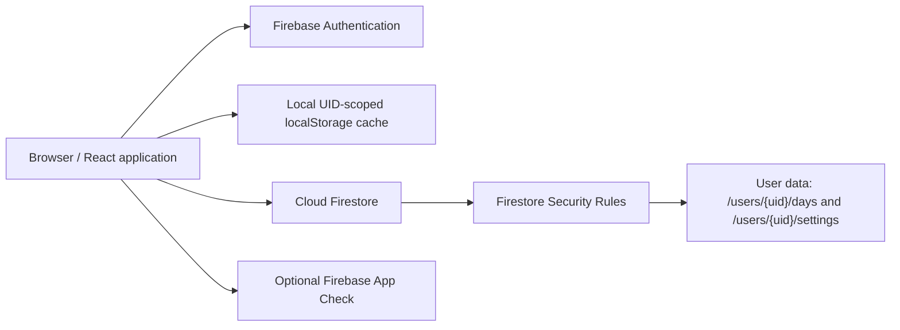

# DAILY OS

DAILY OS is a personal daily-life tracker for schedules, habits, academics, data structures practice, projects, workouts, and daily review. It is a React + Vite application backed by Firebase Authentication and Cloud Firestore.

This repository is a self-hosted template. Each deployment should use its own Firebase project, Web App configuration, Google Sign-In setup, Firestore database, and Hosting site. No shared Firebase project or hosted instance is required.

## Quick Start

The shortest local setup is:

```bash
npm install
copy .env.example .env.local
npm run dev
```

Before signing in, fill `.env.local` with the Firebase Web App values from your own Firebase project. The app can render without Firebase configuration, but cloud authentication and Firestore persistence will not be available.

## Features

- Daily dashboard for planning and completion tracking
- Schedule, habits, academics, DSA, projects, workouts, and daily review views
- Calendar and history views across saved days
- Google Sign-In through Firebase Authentication
- Firestore persistence scoped to the authenticated user UID
- Local browser caching scoped to the authenticated user UID
- JSON backup export and validated import
- Optional Firebase App Check with reCAPTCHA v3
- Responsive layout for desktop and mobile browsers

## Architecture



The main state and view composition live in `src/App.tsx`. Firebase access and UID-scoped cache helpers live in `src/firebase.ts`. UI views are in `src/components/`, reusable Today sections are  qin `src/components/today/`, and input/backup helpers are in `src/utils/`. `firestore.rules` protects the `/users/{uid}/` data tree.

## Technology Stack

- React 19 and TypeScript
- Vite
- Firebase Authentication with Google provider
- Cloud Firestore
- Firebase Hosting
- Tailwind CSS through the Vite plugin
- `lucide-react` and `motion` for UI details

## Create Your Firebase Project

Use a separate Firebase project for each deployment.

1. Open the [Firebase Console](https://console.firebase.google.com/) and create a project.
2. In **Authentication > Sign-in method**, enable the **Google** provider.
3. In **Firestore Database**, create a database in the region you choose.
4. In **Project settings > Your apps**, add a Web App. Firebase will show the configuration values required below.
5. Add the local development hostname (`localhost`) and every production hostname to **Authentication > Settings > Authorized domains**. For Firebase Hosting, this normally includes your own `<project-id>.web.app` and `<project-id>.firebaseapp.com` domains.
6. Copy the Web App configuration into `.env.local`.

Firebase Web API keys identify a project; they do not grant database access by themselves. Authentication and the Firestore rules enforce user data isolation. Do not treat the browser configuration as a server secret, and never commit service-account credentials or private keys.

### Environment Variables

Copy the template and fill only values from your own Firebase Web App:

```bash
copy .env.example .env.local
```

```dotenv
VITE_FIREBASE_API_KEY=
VITE_FIREBASE_AUTH_DOMAIN=
VITE_FIREBASE_PROJECT_ID=
VITE_FIREBASE_STORAGE_BUCKET=
VITE_FIREBASE_MESSAGING_SENDER_ID=
VITE_FIREBASE_APP_ID=
VITE_FIREBASE_RECAPTCHA_SITE_KEY=
```

`VITE_FIREBASE_RECAPTCHA_SITE_KEY` is optional. When present, the application initializes Firebase App Check with reCAPTCHA v3. App Check enforcement must be enabled and monitored separately in the Firebase Console after testing. The app does not claim App Check protection when this variable is absent.

## Local Development

Requirements:

- Node.js 18 or newer
- npm
- A Firebase project for sign-in and cloud sync

Install dependencies and start the development server:

```bash
npm install
npm run dev
```

Open the local URL printed by Vite, normally `http://localhost:3000`.

Available repository scripts:

```bash
npm run dev
npm run build
npm run preview
npm run lint
npm run clean
```

`npm run lint` runs `tsc --noEmit`. The security test file is a lightweight rules-logic evaluator and can be run with:

```bash
npx tsx tests/firestore.rules.test.ts
```

## Firebase Hosting Deployment

Install the Firebase CLI and authenticate it:

```bash
npm install -g firebase-tools
firebase login
```

Build the application, then associate the repository with your own Firebase project:

```bash
npm run build
firebase use --add
```

Choose your project in the prompt and use the alias `default`. The project selection is stored in the local `.firebaserc`, which is intentionally ignored by this template so personal project IDs are not committed.

Deploy Hosting and Firestore rules:

```bash
firebase deploy --only hosting
firebase deploy --only firestore:rules
```

Or deploy both at once:

```bash
firebase deploy --only hosting,firestore:rules
```

The checked-in `firebase.json` serves `dist/` and rewrites application routes to `index.html`. If you use a non-default Hosting site, update the local Firebase CLI configuration with your own site before deploying.

## Privacy and Security Model

- Google Sign-In is required for cloud-backed tracker data. The client does not fabricate users or mock authentication.
- Firestore data is stored under `/users/{uid}/days/{dayId}` and `/users/{uid}/settings/{settingId}`. The rules require an authenticated request whose UID matches the path UID.
- Unknown Firestore paths are denied by default. Day IDs must use `YYYY-MM-DD`, and important field sizes and ranges are checked server-side.
- Local browser cache keys include the authenticated UID. Unauthenticated startup does not load another user's cached records, and sign-out removes the active user's cache.
- `localStorage` is not encrypted storage. Anyone with access to the browser profile or device may be able to inspect it.
- JSON backups contain personal tracker data. Treat exported files as sensitive and do not commit them.
- App Check is optional in the current implementation. Configure a reCAPTCHA v3 site key and enable enforcement in Firebase only after verifying the deployment.

## Mobile Use

Deploy the application to your own Firebase Hosting site and open it in a mobile browser. Use the browser's **Add to Home Screen** action if you want an app-like shortcut. The UI is responsive; no separate mobile build is required.

## Troubleshooting

### Google Sign-In reports an unauthorized domain

Add the exact hostname shown by the application to **Firebase Console > Authentication > Settings > Authorized domains**. Include `localhost` for local development and the domain used by your own Hosting deployment. Do not add a domain belonging to another deployment.

### Firebase is not configured

Check that `.env.local` exists at the repository root, contains your own `VITE_FIREBASE_API_KEY` and `VITE_FIREBASE_PROJECT_ID`, and restart Vite after changing it.

### Firestore requests are denied

Confirm that the signed-in user is authenticated, that `firestore.rules` has been deployed to the same Firebase project, and that the document path remains under `/users/{your-auth-uid}/`.

### Hosting shows an old or blank build

Run `npm run build` before deploying and verify that `firebase.json` points to `dist/`. Use `firebase use` to confirm that the CLI is targeting your project.

### App Check blocks requests

Check the reCAPTCHA site key, authorized domains, and App Check metrics in Firebase. During local development the code enables Firebase App Check debug mode; use the generated debug token only in your own Firebase project and do not commit it.

## Security Reporting

Please read [SECURITY.md](SECURITY.md) before reporting a vulnerability. Do not include tracker exports, credentials, tokens, or private Firebase configuration in an issue.

## Contributing

See [CONTRIBUTING.md](CONTRIBUTING.md) for the development and pull request guidelines.

## License

DAILY OS is prepared for release under the MIT License. Replace the placeholder copyright holder in [LICENSE](LICENSE) before publishing or distributing the repository.
